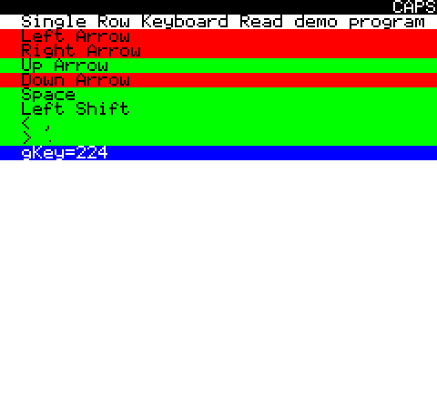

# Keyboard-SingleRow
Sample code demonstrating how to read a single row of the keyboard without using the code from the Oric system ROM.

# How to build
This code sample requires the [Oric SDK](https://osdk.org/index.php?page=download) to build.

Just run "osdk_build.bat" to compile it, and then "osdk_execute.bat" to launch it.

# How to use
After building and running the project, you should see the following UI:

You can press any of the keys on the bottom row, and each of the pressed key will highlight on the list (limited by the keyboard ability to support multiple key presses at the same time)

The gKey value shows the total value of all the pressed keys (each is represented by a single bit)

# Reasons
If you are wondering why anyone would want to reinvent the wheel, you need to know a few things about the Oric:
- The system IRQ runs at 100hz by default, which on the poor 1mhz 6502 is quite costly (simply disabling the IRQ can provide up to a 20% performance boost)
- Trying to reduce the system IRQ from 100hz to 50hz tends to cause problems, so you need to run your own handler anyway.
- If you are trying to free as much memory as possible for you own usage, you can exploit the fact that the disk drive system gives your access to the top 16KB of RAM which are normally hidden by the system ROM, which also mean you can use the entire zero page and page 2 whatever way you want.

So obviously if you disable the ROM you have to do everything yourself, including driving the keyboard.

# Limitations
This code is not trying to be a complete recreation of the system ROM; which means...
- It only manages a single row of the keyboard

# Authors
This code is the result of a cooperation between multiple people.
- Jonathan Bristow (Twilighte) made the first version which properly set up the VIA and keyboard hardware
- Mickaël Pointier (Dbug) for this small demo and the article on OSDK.ORG

# Additional information
You can find more information on the topic in various places:
- [The Oric Keyboard matrix](https://wiki.defence-force.org/doku.php?id=oric:hardware:oric_keyboard) on the Defence Force wiki
- [Keyboard Handling article (part 1)](https://osdk.org/index.php?page=articles&ref=ART16) in the OSDK articles section
